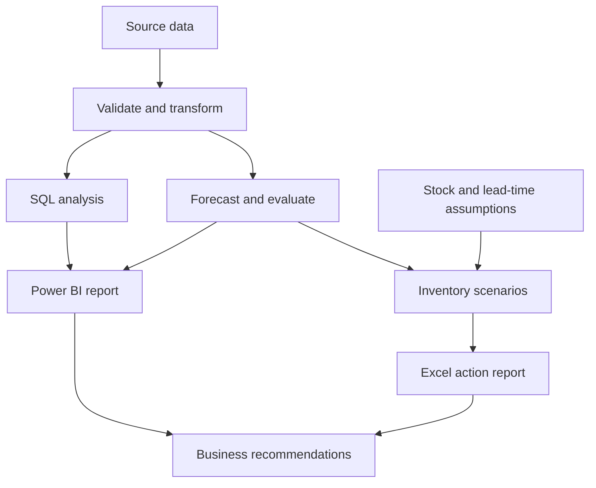

<div align="center">

<h1>📦 Retail Demand & Inventory Analytics</h1>

<p><strong>Understand demand. Anticipate shortages. Make better inventory decisions.</strong></p>

<p>A business analytics project connecting historical sales, demand forecasting,<br>and transparent replenishment recommendations.</p>


<br><br>


<p><sub>Planned technology stack · Implementation and evaluation pending</sub></p>

<a href="#the-business-question">Business Case</a> ·
<a href="#planned-capabilities">Capabilities</a> ·
<a href="#proposed-workflow">Workflow</a> ·
<a href="#delivery-roadmap">Roadmap</a>

</div>

---

> [!NOTE]
> **Current stage: project planning.** This README defines the intended scope and implementation roadmap. The pipeline, models, dashboard, and results are not yet implemented. Checklists will be updated as working deliverables are added.

## The business question

**What should a retail team replenish, when should it act, and what evidence supports that decision?**

Retail inventory decisions involve competing risks: too little stock can leave demand unmet, while too much stock ties up working capital. Historical sales provide a starting point, but useful decisions also require attention to seasonality, forecast uncertainty, supplier lead times, and available inventory.

This project will explore that decision process through a reproducible analytics workflow, with recommendations tied to explicit assumptions.

| Intended user | Question to answer | Planned output |
| :--- | :--- | :--- |
| Business analyst | What changed across products and periods? | SQL analysis and KPI dashboard |
| Inventory planner | Which products may need replenishment? | Prioritized replenishment report |
| Operations manager | How do lead-time assumptions change the plan? | Inventory scenario comparison |
| Business stakeholder | What action is justified, and what remains uncertain? | Concise findings presentation |

## Planned capabilities

### 01 · Understand historical performance

- Validate transaction dates, quantities, product identifiers, and missing values.
- Document duplicate handling, cancellations, returns, and aggregation rules.
- Analyse product-level sales, monthly trends, and category or regional patterns where fields are available.
- Distinguish observed sales from unconstrained demand when stockout information is unavailable.

### 02 · Forecast product demand

- Establish a seasonal-naive baseline before introducing a more complex model.
- Build lag and rolling features using only information available at forecast time.
- Compare a candidate model with the baseline using chronological validation.
- Review errors by product and period, including low-volume and intermittent demand.

### 03 · Translate forecasts into inventory scenarios

- Estimate demand over a specified supplier lead time and review period.
- Calculate inventory position from available inventory, incoming orders, and backorders where known.
- Explore replenishment quantities under documented safety-stock assumptions.
- Flag recommendations that depend on simulated inputs or incomplete data.

### 04 · Communicate decisions

- Build a Power BI report with historical performance, forecast comparisons, and inventory scenarios.
- Export an Excel replenishment summary with product-level explanations.
- Present findings, recommended actions, and limitations in a five-slide business review.

## Proposed workflow



## Metrics that matter

| Area | Metric | Interpretation |
| :--- | :--- | :--- |
| Sales | Net units sold | Units sold after the documented return/cancellation treatment |
| Revenue | Net sales revenue | Sales value calculated consistently with the source schema |
| Forecasting | MAE | Average absolute forecast error, expressed in units |
| Forecasting | WAPE | Total absolute error divided by total actual demand; undefined when total actual demand is zero |
| Inventory | Inventory position | On-hand stock + incoming stock − backorders |
| Inventory | Suggested order quantity | Nonnegative gap between target stock and inventory position |

**Initial replenishment rule:**

```text
Target stock = forecast demand over the protection period + safety stock
Suggested order quantity = max(0, target stock - inventory position)
Protection period = supplier lead time + inventory review interval
```

This is a starting policy for scenario analysis. Order quantities may need further adjustment for pack sizes, minimum orders, budget limits, or storage capacity. It is not a claim of optimal inventory allocation.

## Data and assumptions

**Dataset selection is pending.** The selected source, license, date coverage, fields, and download instructions will be recorded before analysis begins.

| Data requirement | Intended use |
| :--- | :--- |
| Transaction date, product identifier, quantity | Core sales analysis and forecasting |
| Sales value or unit price | Revenue analysis |
| Category, region, or store identifier | Optional segment comparisons |
| Inventory snapshots and incoming orders | Inventory position, if available |
| Supplier lead times and stock policy | Replenishment scenarios |

If inventory or supplier information is absent, those inputs will be clearly labelled **simulated assumptions**. Revenue will not be described as profit without cost data. Forecast performance will not be presented as realized business impact.

## Dashboard blueprint

| Planned page | Contents | Decision supported |
| :--- | :--- | :--- |
| **Business Overview** | Sales KPIs, period trends, product and segment filters | Where should the team investigate? |
| **Demand Outlook** | Actual versus predicted demand, baseline comparison, error breakdown | How reliable is the forecast? |
| **Inventory Decisions** | Stock assumptions, target quantities, replenishment priorities | What should the planner review next? |

Dashboard screenshots and a walkthrough will be added after implementation.

## Planned repository layout

The following paths describe the proposed structure; they are not a list of files already present.

| Path | Purpose |
| :--- | :--- |
| `data/README.md` | Dataset provenance, license, and acquisition instructions |
| `notebooks/` | Exploration and forecast experiments |
| `sql/` | Schema, transformations, and business queries |
| `src/data/` | Reusable ingestion and validation code |
| `src/forecasting/` | Feature generation, baselines, and evaluation |
| `src/inventory/` | Replenishment rules and scenario logic |
| `dashboards/` | Power BI report and screenshots |
| `reports/` | Findings, Excel exports, and presentation |
| `docs/` | Requirements, KPI definitions, and assumptions |
| `tests/` | Data checks and tests for decision logic |

## Delivery roadmap

- [x] Define the project scope and document the proposed workflow.
- [ ] Select a dataset and document its provenance and license.
- [ ] Write a business brief, KPI dictionary, and acceptance criteria.
- [ ] Implement ingestion, data validation, and cleaning.
- [ ] Complete SQL analysis and exploratory notebooks.
- [ ] Build the baseline forecast and chronological evaluation.
- [ ] Compare one candidate model against the baseline.
- [ ] Implement inventory scenarios with explicit assumptions.
- [ ] Build the Power BI dashboard and Excel report.
- [ ] Publish findings, screenshots, and reproducible setup instructions.

## Validation plan

- **Data integrity:** check required fields, date coverage, duplicate records, and documented treatment of negative quantities.
- **Reconciliation:** match headline totals across Python, SQL, Excel, and Power BI.
- **Forecast validity:** avoid future-data leakage, evaluate chronologically, and retain baseline results even if the candidate model performs worse.
- **Decision logic:** check zero demand, missing lead times, sufficient existing stock, and nonnegative order quantities.
- **Business clarity:** attach assumptions and explanations to recommendations so a reader can trace each decision.

## Getting started

This repository is currently a project specification. There is no runnable application or released dashboard yet. Installation commands, dependency versions, dataset setup, and execution instructions will be added with the first working implementation.

## Results

**Evaluation pending.** No forecast scores, cost savings, stockout reductions, or deployment outcomes are claimed at this stage. Results will be published with the dataset, evaluation period, baseline comparison, and known limitations.

---

<div align="center">

<strong>Rajput Aditya Singh</strong><br>
<a href="https://github.com/Rajadi16">GitHub</a> ·
<a href="https://www.linkedin.com/in/rajput-aditya-singh/">LinkedIn</a>

<p><sub>Independent portfolio project · Business analysis, forecasting, and decision support</sub></p>

</div>
